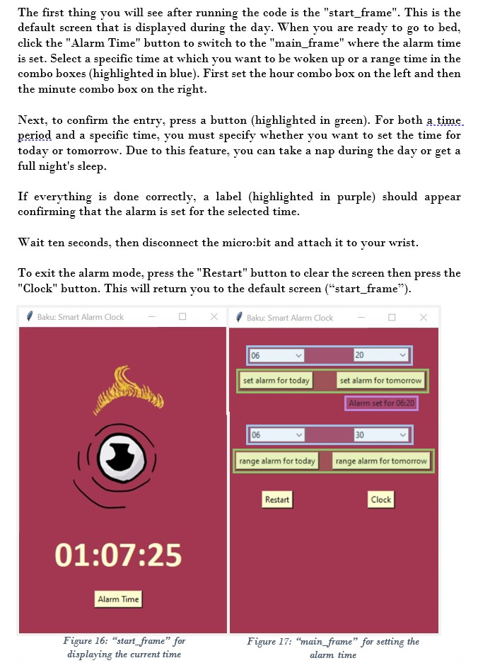

# Baku: Creating a Smart Alarm Clock
Matura thesis

> "Baku" is a sleep phase alarm clock that wakes you up in an "almost awake moment" so you feel refreshed and awake when you wake up. During a period set by the user, the sleep phase alarm clock uses a micro:bit movement sensor to measure our movements, which increase during these almost-wake phases. 
> Live demo [coming soon](https://www.example.com). 

## Table of Contents
* [What are the benefits of the smart alarm clock?]
* [Materials needed]
* [Features]
* [User Instructions]
* [Setup]
* [Project Status]
* [Room for Improvement]
* [Contact]

## What are the benefits of the smart alarm clock?
Many people still feel drowsy even after a full night's sleep. This sleepiness is not due to HOW long you sleep, but WHEN you wake up. This sleep alarm clock can help you sleep better! 
The project was created in the context of a Matura thesis. I chose the topic of "sleep" because most people know so little about it, even though we spend many hours doing it every day.

## Materials needed
- Computer or a Raspberry Pi 3 Model B
- 2x BBC micro:bit Version 2
- USB micro-B plug
- pressure sensor. Building instructions on: https://microbit.org/projects/make-it-code-it/pressure-switch-alarm/

## Features
The smart alarm clock has multiple features
- telling the current time
- setting the alarm for a specific time (“set_alarm_time” mode)
- setting the alarm for a time period to check for light sleep (“range_alarm_time” mode)

## User Instructions
The first thing you will see after running the code is the "start_frame". This is the default screen that is displayed during the day. When you are ready to go to bed, click the "Alarm Time" button to switch to the "main_frame" where the alarm time is set. Select a specific time at which you want to be woken up or a range time in the combo boxes (highlighted in blue). First set the hour combo box on the left and then the minute combo box on the right.

Next, to confirm the entry, press a button (highlighted in green). For both a time period and a specific time, you must specify whether you want to set the time for today or tomorrow. Due to this feature, you can take a nap during the day or get a full night's sleep. 

If everything is done correctly, a label (highlighted in purple) should appear confirming that the alarm is set for the selected time.

Wait ten seconds, then disconnect the micro:bit and attach it to your wrist.

To exit the alarm mode, press the "Restart" button to clear the screen then press the "Clock" button. This will return you to the default screen (“start_frame”). 

## Setup
There are two micro:bit files: one for the micro:bit pressure sensor and one for the micro:bit motion sensor. Flash the code from the Computer or Raspberry Pi onto the respective micro:bits.

When the Tkinter code is run (constants file and main file) on the computer or Raspberry Pi, the micro:bit must be connected via micro-USB. However, once a time has been selected and confirmed with a button, the cable can be removed. 

## Project Status
Project is: _complete_ 

## Room for Improvement
Room for improvement:
- Heart rate alongside movement sensors
- Bluetooth Low Energy (BLE) connection instead of a serial connection (cable)

## Contact
Created by [@AlenaMosimann]( https://github.com/AlenaMosimann) - feel free to contact me!
